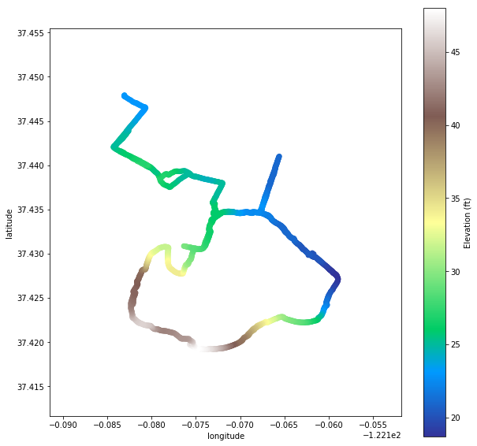

# GPS Run Tracker
Christopher Bronner -- christopher.bronner@gmail.com
30 May 2018

This python script imports gpx files recorded with the Runkeeper app and extracts statistics.

DESCRIPTION OF FILES
====================================

GPS tracker.ipynb

- Reads a singe gpx file and extracts different parameters
- Plots height profile, pace profile and running maps

GPS evaluate file.ipynb
eval_file.py (essentially the same, exported)

- Possesses the functionality of GPS tracker.ipynb but in a single function
- The function evaluate_file(filename) returns a list a parameters

GPS multiple file analysis.ipynb

- Runs eval_file.py on every gpx file in a specified folder
- Saves the extracted parameters in a csv file named run-stats.csv

run stat analysis.ipynb

- Analyzes run-stats.csv and shows a list of longest runs and fastest half marathons

Further development goals:
====================================

- Overlay different runs in one map
- Identify whether two runs were on the same route
- Identify where the runner lives
