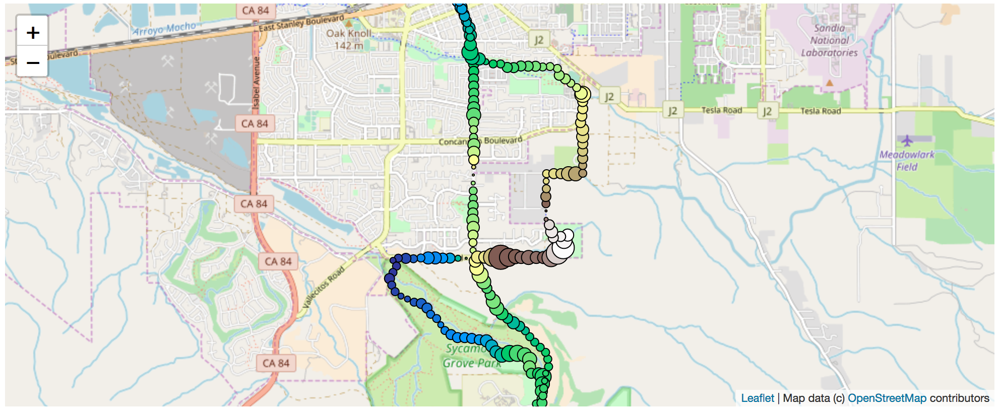

# GPS Run Tracker
Christopher Bronner -- christopher.bronner@gmail.com
2 Jun 2018

This python script imports gpx files recorded with the Runkeeper app, extracts statistics, visualizes runs and compares multiple runs.

Check out the annotated notebooks 'GPS tracker.ipynb' and 'run stat analysis.ipynb' to see what the script does!

DESCRIPTION OF FILES
====================================

<b>[GPS tracker.ipynb](https://github.com/christopherbronner/gps-run-tracker/blob/master/GPS%20tracker.ipynb)</b>
- Reads a singe gpx file and extracts different metrics
- Visualizes the data in a height profile, a pace profile and running maps

[GPS evaluate file.ipynb](https://github.com/christopherbronner/gps-run-tracker/blob/master/GPS%20evaluate%20file.ipynb)
eval_file.py (contains the functionality of the above GPS tracker, but is readily importable)

[GPS multiple file analysis.ipynb](https://github.com/christopherbronner/gps-run-tracker/blob/master/GPS%20multiple%20file%20analysis.ipynb)
- Runs eval_file.py on every gpx file in a specified folder
- Saves the extracted parameters in a csv file named run-stats.csv

<b>[run stat analysis.ipynb](https://github.com/christopherbronner/gps-run-tracker/blob/master/run%20stat%20analysis.ipynb)</b>
- Analyzes run-stats.csv and shows a list of longest runs and fastest half marathons

Further development goals:
====================================

- Overlay different runs in one map
- Identify whether two runs were on the same route
- Identify where the runner lives
